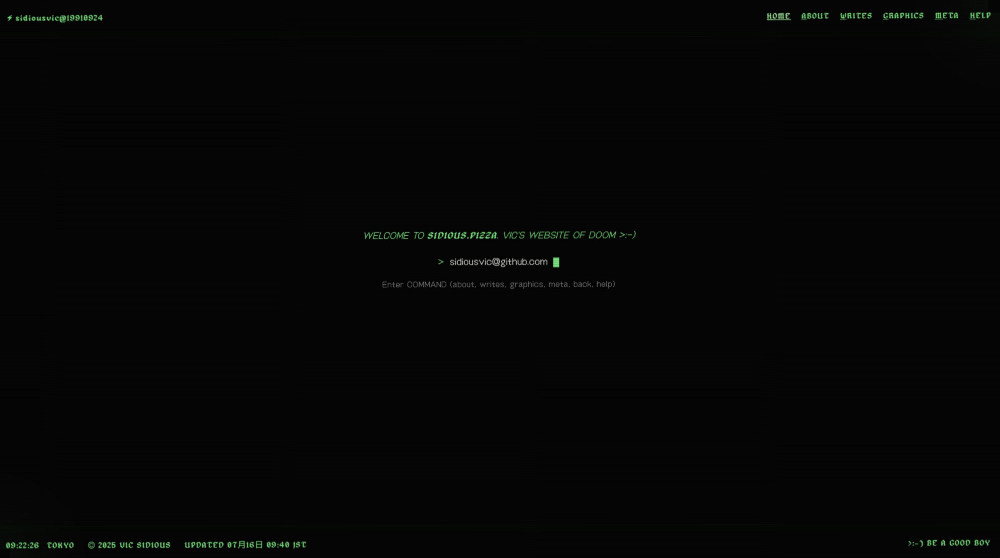

# SIDIOUS.PIZZA

Vic's little corner of the internet

<a href="sidious.pizza"></a>

## `cat what_is_this.md`

This is my personal website.

## `run`

This site is built with [Lume](https://lume.land/), a static site generator for Deno.

0. `brew install deno`

1. `git clone`
 
 ```bash
   git clone https://github.com/sidiousvic/sidious.pizza.git
   cd sidious.pizza
```

2. `deno task serve`

This will start a local server at port `3000` with live reloading.

3. `deno task build`

This will generate the static website files in the `_site` directory.

## `echo $DESIGN_PHILOSOPHY`

I'm making this with a focus on experience, with a nostalgic nod at the internet 90s of my young years. Don't expect to find beautiful code here, I'm a working man and I've got nothing to prove.

## `echo meta.txt --list --pretty`

### Features

- Terminal-inspired interface with CRT screen effects
- Command-line navigation system with hidden bonuses
- Responsive design that works on mobile devices
- Easter eggs and secret commands (try typing "hello" or other phrases)
- Minimalist approach to content presentation

### File Structure

- `_includes/` - Layout templates and assets
- `writes/` - Blog posts and writing content
- `_site/` - Generated static files (not tracked in git)
- `_config.ts` - Lume configuration
- `deno.json` - Deno configuration and tasks

## License

MIT License

Copyright (c) 2023-2025 Vic (sidiousvic)

Permission is hereby granted, free of charge, to any person obtaining a copy
of this software and associated documentation files (the "Software"), to deal
in the Software without restriction, including without limitation the rights
to use, copy, modify, merge, publish, distribute, sublicense, and/or sell
copies of the Software, and to permit persons to whom the Software is
furnished to do so, subject to the following conditions:

The above copyright notice and this permission notice shall be included in all
copies or substantial portions of the Software.

THE SOFTWARE IS PROVIDED "AS IS", WITHOUT WARRANTY OF ANY KIND, EXPRESS OR
IMPLIED, INCLUDING BUT NOT LIMITED TO THE WARRANTIES OF MERCHANTABILITY,
FITNESS FOR A PARTICULAR PURPOSE AND NONINFRINGEMENT. IN NO EVENT SHALL THE
AUTHORS OR COPYRIGHT HOLDERS BE LIABLE FOR ANY CLAIM, DAMAGES OR OTHER
LIABILITY, WHETHER IN AN ACTION OF CONTRACT, TORT OR OTHERWISE, ARISING FROM,
OUT OF OR IN CONNECTION WITH THE SOFTWARE OR THE USE OR OTHER DEALINGS IN THE
SOFTWARE.

## `whereis "vic"`

Find me at @sidiousvic on several platforms.
