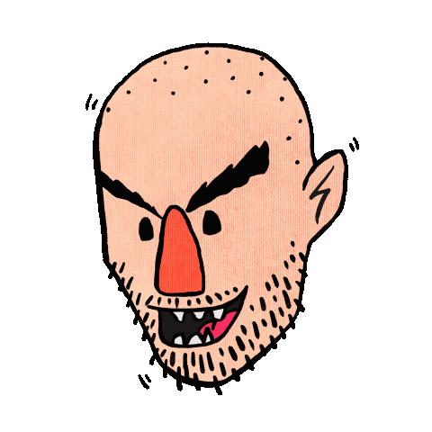

<h2>Hello, my name is VIC.</h2>
<h2>Welcome to my website.</h2>

<picture class="no-border">
    <!---->
</picture>

Press the <em>`z`</em> key anytime to enter zen mode.
You can explore by going to the <a href="/sitemap">sitemap.</a>
